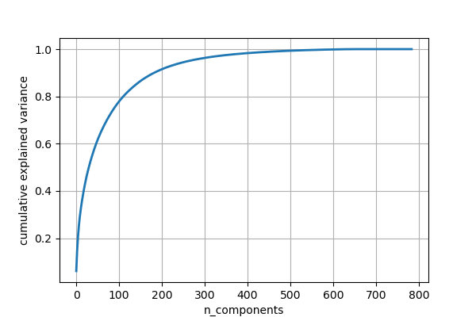

# Clustering Algorithm Comparison  

Evaluation and comparison of three common clustering algorithms:  
KMeans, AgglomerativeClustering and DBSCAN.
 
Dimensionality reduction and visualization of high-dimensional features data, PCA vs TSNE.

#### Dataset reference
1) Dow Jones Index https://archive.ics.uci.edu/ml/datasets/Dow+Jones+Index#
2) Facebook Live Sellers in Thailand https://archive.ics.uci.edu/ml/datasets/Facebook+Live+Sellers+in+Thailand
3) Sales Transactions   https://archive.ics.uci.edu/ml/datasets/Sales_Transactions_Dataset_Weekly
4) Water Treatment Plant https://archive.ics.uci.edu/ml/datasets/Water+Treatment+Plant

#### main.py
 

